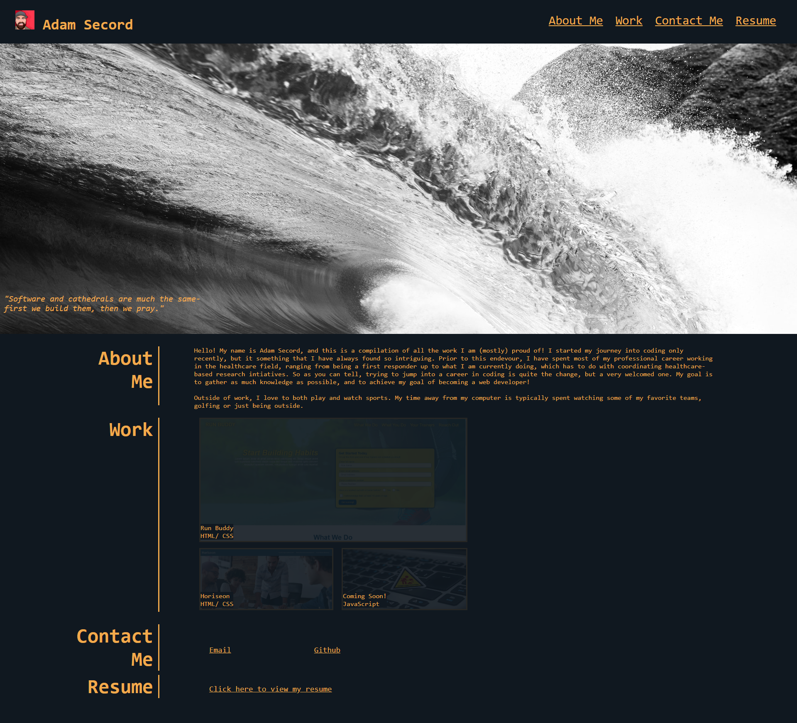

# my-portfolio

I created this project as a way to present all of my current projects for potential employeers to view.

Below is a screenshot of this project: 

Content-wise, there is a section about myself, links to my current completed projects, how to contact me and my resume. 

To access this project directly, please follow this link: https://asecord92.github.io/my-portfolio
